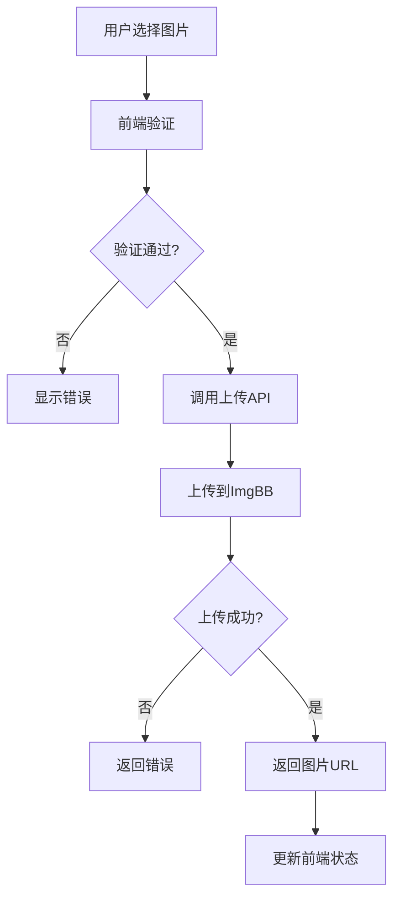
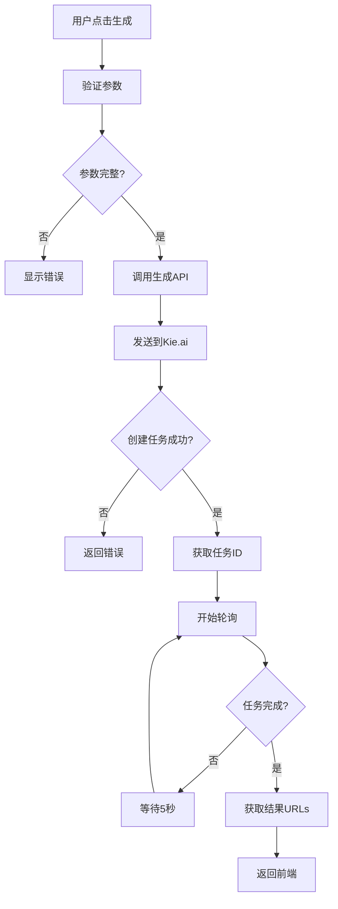

# 🖼️ 图片系统完整技术文档

## 📋 系统概述

本图片系统基于Next.js构建，集成Kie.ai GPT-4o-image API，提供图像上传、处理和生成功能。

## 🏗️ 系统架构

```
┌─────────────────┐    ┌──────────────────┐    ┌─────────────────┐
│   前端客户端     │    │   Next.js API    │    │   Kie.ai API    │
│   (React)       │    │    Routes        │    │   (外部服务)    │
└─────────────────┘    └──────────────────┘    └─────────────────┘
         │                       │                       │
         │ 1. 上传图片           │                       │
         ├───────────────────────►│                       │
         │                       │ 2. 上传到ImgBB        │
         │                       ├───────────────────────►│
         │                       │                       │ 3. 返回URL
         │                       │◄───────────────────────┤
         │                       │ 4. 生成图像请求       │
         │                       ├───────────────────────►│
         │                       │                       │ 5. 创建任务
         │                       │◄───────────────────────┤
         │                       │ 6. 轮询状态           │
         │                       ├───────────────────────►│
         │                       │                       │ 7. 返回结果
         │                       │◄───────────────────────┤
         │◄──────────────────────┤                       │
         │ 8. 显示结果           │                       │
```

## 🔄 数据流详解

### 1. 图片上传流程



### 2. 图像生成流程



## 🛠️ API接口详解

### 1. 图片上传API

**端点**: `POST /api/upload-image`

**功能**: 将用户上传的图片存储到ImgBB并返回可访问的URL

**请求参数**:
```typescript
interface UploadRequest {
  file: File;  // 图片文件
}
```

**响应格式**:
```typescript
interface UploadResponse {
  success: boolean;
  url: string;        // 图片访问URL
  fileName: string;   // 文件名
  fileSize: number;   // 文件大小
}
```

**示例代码**:
```typescript
// 前端上传代码
const uploadImage = async (file: File) => {
  const formData = new FormData();
  formData.append('file', file);

  const response = await fetch('/api/upload-image', {
    method: 'POST',
    body: formData
  });

  if (!response.ok) {
    throw new Error('上传失败');
  }

  const data = await response.json();
  return data.url;
};

// 使用示例
const handleFileUpload = async (event: React.ChangeEvent<HTMLInputElement>) => {
  const file = event.target.files?.[0];
  if (file) {
    try {
      const imageUrl = await uploadImage(file);
      setFileUrl(imageUrl);
      console.log('上传成功:', imageUrl);
    } catch (error) {
      console.error('上传失败:', error);
    }
  }
};
```

### 2. 图像生成API

**端点**: `POST /api/generate-image`

**功能**: 调用Kie.ai API生成图像

**请求参数**:
```typescript
interface GenerateRequest {
  fileUrl?: string;        // 参考图片URL
  prompt: string;          // 提示词
  enhancePrompt?: boolean; // 是否增强提示词
  size?: string;          // 图片比例: "1:1" | "3:2" | "2:3"
}
```

**响应格式**:
```typescript
interface GenerateResponse {
  success: boolean;
  mode: 'external';
  url: string;              // 主图片URL
  urls: string[];           // 所有图片URLs
  taskId: string;           // 任务ID
  generation_count: number; // 生成数量
  api_key_used: string;     // 使用的API密钥
}
```

**示例代码**:
```typescript
// 前端生成代码
const generateImage = async (params: GenerateRequest) => {
  const response = await fetch('/api/generate-image', {
    method: 'POST',
    headers: {
      'Content-Type': 'application/json',
    },
    body: JSON.stringify(params)
  });

  if (!response.ok) {
    const errorData = await response.json();
    throw new Error(errorData.error || '生成失败');
  }

  const data = await response.json();
  return data;
};

// 使用示例
const handleGenerate = async () => {
  try {
    setIsGenerating(true);
    const result = await generateImage({
      fileUrl: selectedImageUrl,
      prompt: "可爱的动漫少女，粉色头发，微笑",
      enhancePrompt: true,
      size: "1:1"
    });
    
    setGeneratedImages(result.urls);
    console.log('生成成功:', result);
  } catch (error) {
    console.error('生成失败:', error);
  } finally {
    setIsGenerating(false);
  }
};
```

### 3. 任务状态查询API

**端点**: `GET /api/task-status`

**功能**: 查询图像生成任务状态

**请求参数**:
```typescript
interface StatusRequest {
  taskId: string;    // 任务ID
  userId: string;    // 用户ID
}
```

**响应格式**:
```typescript
interface StatusResponse {
  code: number;
  data: {
    status: 'PENDING' | 'PROCESSING' | 'SUCCESS' | 'FAILED';
    response?: {
      resultUrls: string[];
    };
    errorMessage?: string;
  };
}
```

## 🔧 路由实现详解

### 1. 图片上传路由

**文件**: `src/app/api/upload-image/route.ts`

```typescript
import { NextRequest, NextResponse } from 'next/server';

export async function POST(request: NextRequest) {
  try {
    const formData = await request.formData();
    const file = formData.get('file') as File;

    if (!file) {
      return NextResponse.json(
        { error: '没有找到文件' },
        { status: 400 }
      );
    }

    // 验证文件类型
    if (!file.type.startsWith('image/')) {
      return NextResponse.json(
        { error: '只支持图片文件' },
        { status: 400 }
      );
    }

    // 验证文件大小 (5MB限制)
    if (file.size > 5 * 1024 * 1024) {
      return NextResponse.json(
        { error: '文件大小不能超过5MB' },
        { status: 400 }
      );
    }

    // 上传到ImgBB
    const imgbbApiKey = process.env.IMGBB_API_KEY;
    const uploadFormData = new FormData();
    uploadFormData.append('image', file);

    const imgbbResponse = await fetch(
      `https://api.imgbb.com/1/upload?key=${imgbbApiKey}`,
      {
        method: 'POST',
        body: uploadFormData
      }
    );

    if (!imgbbResponse.ok) {
      throw new Error('ImgBB上传失败');
    }

    const imgbbData = await imgbbResponse.json();
    const imageUrl = imgbbData.data.url;

    return NextResponse.json({
      success: true,
      url: imageUrl,
      fileName: file.name,
      fileSize: file.size
    });

  } catch (error) {
    console.error('上传错误:', error);
    return NextResponse.json(
      { error: '上传失败，请重试' },
      { status: 500 }
    );
  }
}
```

### 2. 图像生成路由

**文件**: `src/app/api/generate-image/route.ts`

```typescript
import { NextRequest, NextResponse } from 'next/server';
import { getApiKeyRotation } from '@/lib/api-key-rotation';

export async function POST(request: NextRequest) {
  try {
    const body = await request.json();
    const { fileUrl, prompt, enhancePrompt, size } = body;

    // 验证必要参数
    if (!prompt) {
      return NextResponse.json(
        { error: '缺少必要参数：prompt' },
        { status: 400 }
      );
    }

    // 获取API密钥
    const rotation = getApiKeyRotation();
    const keyInfo = rotation.getNextKey();

    if (!keyInfo) {
      return NextResponse.json(
        { error: '没有可用的API密钥' },
        { status: 500 }
      );
    }

    const { key: apiKey, userId: defaultUserId } = keyInfo;

    // 构建请求数据
    const requestData = {
      prompt: enhancePrompt ? `anime style, high quality, detailed, kawaii, ${prompt}` : prompt,
      model: 'gpt-4o-image',
      userId: defaultUserId,
      size: size || '1:1'
    };

    // 添加参考图片
    if (fileUrl && !fileUrl.startsWith('data:')) {
      requestData.filesUrl = [fileUrl];
    }

    // 调用Kie.ai API
    const baseUrl = process.env.KIE_AI_BASE_URL || 'https://api.kie.ai';
    const generateEndpoint = `${baseUrl}/api/v1/gpt4o-image/generate`;

    const response = await fetch(generateEndpoint, {
      method: 'POST',
      headers: {
        'Content-Type': 'application/json',
        'Authorization': `Bearer ${apiKey}`,
        'User-Agent': 'Mozilla/5.0 (Windows NT 10.0; Win64; x64) AppleWebKit/537.36',
        'Accept': 'application/json'
      },
      body: JSON.stringify(requestData)
    });

    if (!response.ok) {
      const errorText = await response.text();
      console.error('Kie.ai API错误:', {
        status: response.status,
        response: errorText
      });
      
      return NextResponse.json({
        error: `API调用失败: ${response.status}`,
        details: errorText
      }, { status: response.status });
    }

    const generateData = await response.json();
    const taskId = generateData.taskId || generateData.data?.taskId;

    if (!taskId) {
      return NextResponse.json({
        error: '无法获取任务ID',
        response: generateData
      }, { status: 500 });
    }

    // 轮询任务状态
    const result = await pollTaskStatus(taskId, defaultUserId, apiKey);
    
    // 记录成功使用
    rotation.recordSuccess(apiKey);

    return NextResponse.json(result);

  } catch (error) {
    console.error('生成错误:', error);
    return NextResponse.json({
      error: '图像生成失败',
      details: error instanceof Error ? error.message : '未知错误'
    }, { status: 500 });
  }
}

// 轮询任务状态
async function pollTaskStatus(taskId: string, userId: string, apiKey: string) {
  const baseUrl = process.env.KIE_AI_BASE_URL || 'https://api.kie.ai';
  const recordEndpoint = `${baseUrl}/api/v1/gpt4o-image/record-info`;
  
  const maxAttempts = 60; // 最多5分钟
  let attempts = 0;

  while (attempts < maxAttempts) {
    await new Promise(resolve => setTimeout(resolve, 5000)); // 等待5秒
    attempts++;

    try {
      const statusUrl = `${recordEndpoint}?taskId=${taskId}&userId=${encodeURIComponent(userId)}`;
      const statusResponse = await fetch(statusUrl, {
        method: 'GET',
        headers: {
          'Authorization': `Bearer ${apiKey}`,
          'User-Agent': 'Mozilla/5.0 (Windows NT 10.0; Win64; x64) AppleWebKit/537.36',
          'Accept': 'application/json'
        }
      });

      if (!statusResponse.ok) {
        if (attempts >= maxAttempts) {
          throw new Error(`状态查询失败: ${statusResponse.status}`);
        }
        continue;
      }

      const statusData = await statusResponse.json();
      const taskData = statusData.data || statusData;

      if (taskData.status === 'SUCCESS' || taskData.status === 'COMPLETED') {
        // 提取结果URLs
        let resultUrls = [];
        if (taskData.response?.resultUrls) {
          resultUrls = Array.isArray(taskData.response.resultUrls) 
            ? taskData.response.resultUrls 
            : [taskData.response.resultUrls];
        }

        if (resultUrls.length > 0) {
          return {
            success: true,
            mode: 'external',
            url: resultUrls[0],
            urls: resultUrls,
            taskId: taskId,
            generation_count: resultUrls.length
          };
        }
      } else if (taskData.status === 'FAILED' || taskData.status === 'ERROR') {
        throw new Error(`任务失败: ${taskData.errorMessage || '未知错误'}`);
      }

    } catch (error) {
      if (attempts >= maxAttempts) {
        throw error;
      }
      console.log('轮询错误，重试中...');
    }
  }

  throw new Error('任务超时');
}
```

## 📊 状态管理

### 1. 应用状态Store

**文件**: `src/store/useAppStore.ts`

```typescript
import { create } from 'zustand';

export type AppState = 'initial' | 'uploading' | 'uploaded' | 'processing' | 'completed' | 'error';
export type ImageSize = '1:1' | '3:2' | '2:3';

interface AppStore {
  // 状态
  currentState: AppState;
  selectedSize: ImageSize;
  
  // 图片数据
  uploadedImage: string | null;
  generatedImages: string[];
  
  // 加载状态
  isLoading: boolean;
  loadingProgress: number;
  loadingMessage: string;
  
  // 错误状态
  error: string | null;
  
  // Actions
  setCurrentState: (state: AppState) => void;
  setSelectedSize: (size: ImageSize) => void;
  setUploadedImage: (url: string | null) => void;
  setGeneratedImages: (urls: string[]) => void;
  setLoading: (loading: boolean, message?: string) => void;
  setLoadingProgress: (progress: number) => void;
  setError: (error: string | null) => void;
  resetApp: () => void;
}

export const useAppStore = create<AppStore>((set) => ({
  // 初始状态
  currentState: 'initial',
  selectedSize: '1:1',
  uploadedImage: null,
  generatedImages: [],
  isLoading: false,
  loadingProgress: 0,
  loadingMessage: '',
  error: null,

  // Actions
  setCurrentState: (state) => set({ currentState: state }),
  setSelectedSize: (size) => set({ selectedSize: size }),
  setUploadedImage: (url) => set({ uploadedImage: url }),
  setGeneratedImages: (urls) => set({ generatedImages: urls }),
  setLoading: (loading, message = '') => set({ 
    isLoading: loading, 
    loadingMessage: message 
  }),
  setLoadingProgress: (progress) => set({ loadingProgress: progress }),
  setError: (error) => set({ error }),
  resetApp: () => set({
    currentState: 'initial',
    uploadedImage: null,
    generatedImages: [],
    isLoading: false,
    loadingProgress: 0,
    loadingMessage: '',
    error: null
  })
}));
```

### 2. 使用示例

```typescript
// 在组件中使用
import { useAppStore } from '@/store/useAppStore';

const MyComponent = () => {
  const {
    currentState,
    selectedSize,
    uploadedImage,
    generatedImages,
    isLoading,
    setCurrentState,
    setSelectedSize,
    setUploadedImage,
    setGeneratedImages,
    setLoading
  } = useAppStore();

  const handleImageUpload = async (file: File) => {
    setLoading(true, '上传中...');
    setCurrentState('uploading');
    
    try {
      const imageUrl = await uploadImage(file);
      setUploadedImage(imageUrl);
      setCurrentState('uploaded');
    } catch (error) {
      setCurrentState('error');
    } finally {
      setLoading(false);
    }
  };

  const handleGenerate = async () => {
    setLoading(true, '生成中...');
    setCurrentState('processing');
    
    try {
      const result = await generateImage({
        fileUrl: uploadedImage,
        prompt: "可爱的动漫少女",
        size: selectedSize
      });
      
      setGeneratedImages(result.urls);
      setCurrentState('completed');
    } catch (error) {
      setCurrentState('error');
    } finally {
      setLoading(false);
    }
  };

  return (
    <div>
      {/* 组件内容 */}
    </div>
  );
};
```

## 🔐 安全配置

### 1. 环境变量

```bash
# .env.local
KIE_AI_API_KEY=your_kie_api_key
KIE_AI_USER_ID=your_user_id
KIE_AI_BASE_URL=https://api.kie.ai
IMGBB_API_KEY=your_imgbb_api_key
HTTP_PROXY=http://127.0.0.1:26001
HTTPS_PROXY=http://127.0.0.1:26001
```

### 2. API密钥轮换

```typescript
// src/lib/api-key-rotation.ts
export class ApiKeyRotation {
  private keys: string[];
  private currentIndex: number = 0;
  private successCount: Map<string, number> = new Map();
  private failureCount: Map<string, number> = new Map();

  constructor() {
    this.keys = process.env.KIE_AI_API_KEY?.split(',') || [];
  }

  getNextKey(): { key: string; userId: string } | null {
    if (this.keys.length === 0) return null;
    
    const key = this.keys[this.currentIndex];
    this.currentIndex = (this.currentIndex + 1) % this.keys.length;
    
    return {
      key,
      userId: process.env.KIE_AI_USER_ID || ''
    };
  }

  recordSuccess(key: string) {
    const count = this.successCount.get(key) || 0;
    this.successCount.set(key, count + 1);
  }

  recordFailure(key: string) {
    const count = this.failureCount.get(key) || 0;
    this.failureCount.set(key, count + 1);
  }

  getStats() {
    return {
      successCount: Object.fromEntries(this.successCount),
      failureCount: Object.fromEntries(this.failureCount)
    };
  }
}

let rotationInstance: ApiKeyRotation | null = null;

export function getApiKeyRotation(): ApiKeyRotation {
  if (!rotationInstance) {
    rotationInstance = new ApiKeyRotation();
  }
  return rotationInstance;
}
```

## 📱 前端组件示例

### 1. 图片上传组件

```typescript
// src/components/ImageUpload.tsx
import { useState, useRef } from 'react';
import { useAppStore } from '@/store/useAppStore';

export default function ImageUpload() {
  const { setUploadedImage, setLoading, setError } = useAppStore();
  const [dragActive, setDragActive] = useState(false);
  const fileInputRef = useRef<HTMLInputElement>(null);

  const uploadImage = async (file: File) => {
    const formData = new FormData();
    formData.append('file', file);

    const response = await fetch('/api/upload-image', {
      method: 'POST',
      body: formData
    });

    if (!response.ok) {
      const errorData = await response.json();
      throw new Error(errorData.error || '上传失败');
    }

    const data = await response.json();
    return data.url;
  };

  const handleFile = async (file: File) => {
    setLoading(true, '上传中...');
    setError(null);

    try {
      const imageUrl = await uploadImage(file);
      setUploadedImage(imageUrl);
    } catch (error) {
      setError(error instanceof Error ? error.message : '上传失败');
    } finally {
      setLoading(false);
    }
  };

  const handleDrop = (e: React.DragEvent) => {
    e.preventDefault();
    setDragActive(false);

    const files = e.dataTransfer.files;
    if (files.length > 0) {
      handleFile(files[0]);
    }
  };

  const handleDragOver = (e: React.DragEvent) => {
    e.preventDefault();
    setDragActive(true);
  };

  const handleDragLeave = () => {
    setDragActive(false);
  };

  return (
    <div
      className={`border-2 border-dashed rounded-lg p-8 text-center transition-colors ${
        dragActive 
          ? 'border-pink-400 bg-pink-50' 
          : 'border-gray-300 hover:border-pink-300'
      }`}
      onDrop={handleDrop}
      onDragOver={handleDragOver}
      onDragLeave={handleDragLeave}
    >
      <input
        ref={fileInputRef}
        type="file"
        accept="image/*"
        onChange={(e) => {
          const file = e.target.files?.[0];
          if (file) handleFile(file);
        }}
        className="hidden"
      />
      
      <div className="space-y-4">
        <div className="text-4xl">📸</div>
        <div className="text-lg font-medium text-gray-700">
          拖拽图片到这里或点击上传
        </div>
        <button
          onClick={() => fileInputRef.current?.click()}
          className="px-4 py-2 bg-pink-500 text-white rounded-lg hover:bg-pink-600 transition-colors"
        >
          选择文件
        </button>
      </div>
    </div>
  );
}
```

### 2. 图像生成组件

```typescript
// src/components/ImageGenerator.tsx
import { useState } from 'react';
import { useAppStore } from '@/store/useAppStore';

export default function ImageGenerator() {
  const { 
    uploadedImage, 
    selectedSize, 
    setSelectedSize, 
    setGeneratedImages, 
    setLoading, 
    setError 
  } = useAppStore();
  
  const [prompt, setPrompt] = useState('');
  const [enhancePrompt, setEnhancePrompt] = useState(false);

  const generateImage = async () => {
    if (!uploadedImage || !prompt.trim()) {
      setError('请先上传图片并输入提示词');
      return;
    }

    setLoading(true, '生成中...');
    setError(null);

    try {
      const response = await fetch('/api/generate-image', {
        method: 'POST',
        headers: {
          'Content-Type': 'application/json',
        },
        body: JSON.stringify({
          fileUrl: uploadedImage,
          prompt: prompt.trim(),
          enhancePrompt,
          size: selectedSize
        })
      });

      if (!response.ok) {
        const errorData = await response.json();
        throw new Error(errorData.error || '生成失败');
      }

      const data = await response.json();
      setGeneratedImages(data.urls);
    } catch (error) {
      setError(error instanceof Error ? error.message : '生成失败');
    } finally {
      setLoading(false);
    }
  };

  return (
    <div className="space-y-6">
      {/* 尺寸选择 */}
      <div>
        <label className="block text-sm font-medium text-gray-700 mb-2">
          选择尺寸
        </label>
        <div className="grid grid-cols-3 gap-3">
          {(['1:1', '3:2', '2:3'] as const).map((size) => (
            <button
              key={size}
              onClick={() => setSelectedSize(size)}
              className={`p-3 rounded-lg border-2 transition-colors ${
                selectedSize === size
                  ? 'border-pink-500 bg-pink-50 text-pink-700'
                  : 'border-gray-300 hover:border-pink-300'
              }`}
            >
              {size}
            </button>
          ))}
        </div>
      </div>

      {/* 提示词输入 */}
      <div>
        <label className="block text-sm font-medium text-gray-700 mb-2">
          提示词
        </label>
        <textarea
          value={prompt}
          onChange={(e) => setPrompt(e.target.value)}
          placeholder="描述您想要的图像效果..."
          className="w-full p-3 border border-gray-300 rounded-lg focus:ring-2 focus:ring-pink-500 focus:border-transparent"
          rows={4}
        />
      </div>

      {/* 增强选项 */}
      <div className="flex items-center">
        <input
          type="checkbox"
          id="enhancePrompt"
          checked={enhancePrompt}
          onChange={(e) => setEnhancePrompt(e.target.checked)}
          className="rounded border-gray-300 text-pink-500 focus:ring-pink-500"
        />
        <label htmlFor="enhancePrompt" className="ml-2 text-sm text-gray-700">
          增强提示词效果
        </label>
      </div>

      {/* 生成按钮 */}
      <button
        onClick={generateImage}
        disabled={!uploadedImage || !prompt.trim()}
        className="w-full py-3 px-4 bg-pink-500 text-white rounded-lg hover:bg-pink-600 disabled:opacity-50 disabled:cursor-not-allowed transition-colors"
      >
        生成图像
      </button>
    </div>
  );
}
```

## 🧪 测试示例

### 1. API测试

```typescript
// tests/api.test.ts
import { describe, it, expect } from 'vitest';

describe('图片上传API', () => {
  it('应该成功上传图片', async () => {
    const formData = new FormData();
    const file = new File(['test'], 'test.jpg', { type: 'image/jpeg' });
    formData.append('file', file);

    const response = await fetch('/api/upload-image', {
      method: 'POST',
      body: formData
    });

    expect(response.ok).toBe(true);
    const data = await response.json();
    expect(data.success).toBe(true);
    expect(data.url).toBeDefined();
  });

  it('应该拒绝非图片文件', async () => {
    const formData = new FormData();
    const file = new File(['test'], 'test.txt', { type: 'text/plain' });
    formData.append('file', file);

    const response = await fetch('/api/upload-image', {
      method: 'POST',
      body: formData
    });

    expect(response.ok).toBe(false);
    const data = await response.json();
    expect(data.error).toContain('只支持图片文件');
  });
});

describe('图像生成API', () => {
  it('应该成功生成图像', async () => {
    const response = await fetch('/api/generate-image', {
      method: 'POST',
      headers: {
        'Content-Type': 'application/json',
      },
      body: JSON.stringify({
        fileUrl: 'https://example.com/image.jpg',
        prompt: '可爱的动漫少女',
        size: '1:1'
      })
    });

    expect(response.ok).toBe(true);
    const data = await response.json();
    expect(data.success).toBe(true);
    expect(data.urls).toBeDefined();
    expect(data.urls.length).toBeGreaterThan(0);
  });

  it('应该验证必要参数', async () => {
    const response = await fetch('/api/generate-image', {
      method: 'POST',
      headers: {
        'Content-Type': 'application/json',
      },
      body: JSON.stringify({
        fileUrl: 'https://example.com/image.jpg',
        size: '1:1'
        // 缺少 prompt
      })
    });

    expect(response.ok).toBe(false);
    const data = await response.json();
    expect(data.error).toContain('缺少必要参数');
  });
});
```

### 2. 组件测试

```typescript
// tests/components.test.tsx
import { render, screen, fireEvent, waitFor } from '@testing-library/react';
import { describe, it, expect, vi } from 'vitest';
import ImageUpload from '../src/components/ImageUpload';

describe('ImageUpload组件', () => {
  it('应该显示上传界面', () => {
    render(<ImageUpload />);
    expect(screen.getByText('拖拽图片到这里或点击上传')).toBeInTheDocument();
    expect(screen.getByText('选择文件')).toBeInTheDocument();
  });

  it('应该处理文件选择', async () => {
    const mockUpload = vi.fn().mockResolvedValue('https://example.com/image.jpg');
    global.fetch = mockUpload;

    render(<ImageUpload />);
    
    const file = new File(['test'], 'test.jpg', { type: 'image/jpeg' });
    const input = screen.getByRole('button', { name: '选择文件' });
    
    fireEvent.click(input);
    
    await waitFor(() => {
      expect(mockUpload).toHaveBeenCalled();
    });
  });
});
```

## 📊 性能优化

### 1. 图片压缩

```typescript
// src/lib/image-compression.ts
export async function compressImage(file: File, maxWidth: number = 1024): Promise<File> {
  return new Promise((resolve) => {
    const canvas = document.createElement('canvas');
    const ctx = canvas.getContext('2d')!;
    const img = new Image();

    img.onload = () => {
      const ratio = Math.min(maxWidth / img.width, maxWidth / img.height);
      canvas.width = img.width * ratio;
      canvas.height = img.height * ratio;

      ctx.drawImage(img, 0, 0, canvas.width, canvas.height);
      
      canvas.toBlob((blob) => {
        if (blob) {
          const compressedFile = new File([blob], file.name, {
            type: file.type,
            lastModified: Date.now()
          });
          resolve(compressedFile);
        }
      }, file.type, 0.8);
    };

    img.src = URL.createObjectURL(file);
  });
}
```

### 2. 缓存策略

```typescript
// src/lib/cache.ts
export class ImageCache {
  private cache = new Map<string, { url: string; timestamp: number }>();
  private maxAge = 24 * 60 * 60 * 1000; // 24小时

  set(key: string, url: string) {
    this.cache.set(key, { url, timestamp: Date.now() });
    this.cleanup();
  }

  get(key: string): string | null {
    const item = this.cache.get(key);
    if (!item) return null;

    if (Date.now() - item.timestamp > this.maxAge) {
      this.cache.delete(key);
      return null;
    }

    return item.url;
  }

  private cleanup() {
    const now = Date.now();
    for (const [key, item] of this.cache.entries()) {
      if (now - item.timestamp > this.maxAge) {
        this.cache.delete(key);
      }
    }
  }
}

export const imageCache = new ImageCache();
```

## 🔍 监控和日志

### 1. 错误监控

```typescript
// src/lib/error-monitoring.ts
export class ErrorMonitor {
  private errors: Array<{
    timestamp: number;
    error: string;
    context: any;
  }> = [];

  logError(error: string, context?: any) {
    this.errors.push({
      timestamp: Date.now(),
      error,
      context
    });

    // 发送到监控服务
    this.sendToMonitoringService(error, context);
  }

  private async sendToMonitoringService(error: string, context?: any) {
    try {
      await fetch('/api/log-error', {
        method: 'POST',
        headers: { 'Content-Type': 'application/json' },
        body: JSON.stringify({ error, context, timestamp: Date.now() })
      });
    } catch (e) {
      console.error('Failed to send error to monitoring service:', e);
    }
  }

  getErrors() {
    return this.errors;
  }

  clearErrors() {
    this.errors = [];
  }
}

export const errorMonitor = new ErrorMonitor();
```

### 2. 性能监控

```typescript
// src/lib/performance-monitoring.ts
export class PerformanceMonitor {
  private metrics: Map<string, number[]> = new Map();

  startTimer(name: string): () => void {
    const start = performance.now();
    return () => this.endTimer(name, start);
  }

  private endTimer(name: string, start: number) {
    const duration = performance.now() - start;
    if (!this.metrics.has(name)) {
      this.metrics.set(name, []);
    }
    this.metrics.get(name)!.push(duration);
  }

  getAverageTime(name: string): number {
    const times = this.metrics.get(name);
    if (!times || times.length === 0) return 0;
    return times.reduce((a, b) => a + b, 0) / times.length;
  }

  getMetrics() {
    const result: Record<string, number> = {};
    for (const [name, times] of this.metrics.entries()) {
      result[name] = this.getAverageTime(name);
    }
    return result;
  }
}

export const performanceMonitor = new PerformanceMonitor();
```

## 📝 总结

这个图片系统提供了完整的图像上传、处理和生成功能，具有以下特点：

1. **完整的API接口**: 支持图片上传、图像生成、状态查询
2. **健壮的错误处理**: 完善的错误捕获和用户提示
3. **状态管理**: 使用Zustand进行全局状态管理
4. **性能优化**: 图片压缩、缓存策略、性能监控
5. **安全配置**: API密钥轮换、环境变量管理
6. **测试覆盖**: 单元测试和集成测试
7. **监控系统**: 错误监控和性能监控

系统设计考虑了可扩展性、可维护性和用户体验，可以作为生产环境的基础架构。 